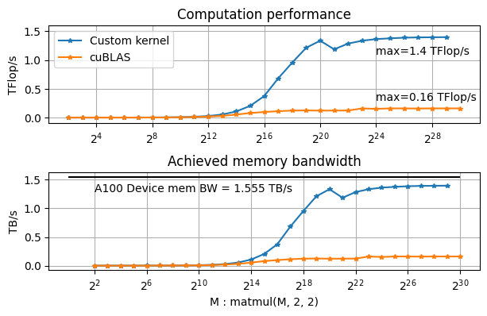

# CUDA kernels for S/C GEMM-(2^p, 2, 2)

since cuBLAS gemm functions are not optimized for such gemm shapes...

## Supported functions
- SGEMM
- CGEMM
- SGEMM strided batch
- CGEMM strided batch

## Build
1. Build the library
```
git clone https://github.com/enp1s0/cuGEMM-Mx2x2
cd cuGEMM-Mx2x2
make
```

2. Link to your program
```
nvcc ... -L/path/to/lib -libcugemm_Mx2x2 ...
```

## Performance

- CGEMM (on A100 GPU)



## Lincense
MIT
